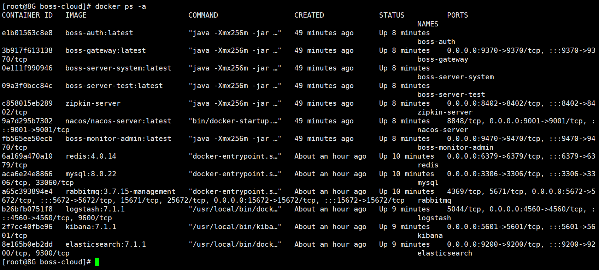
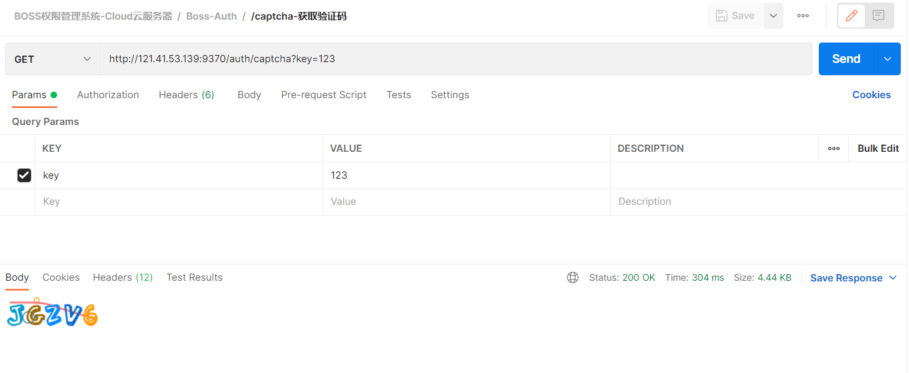
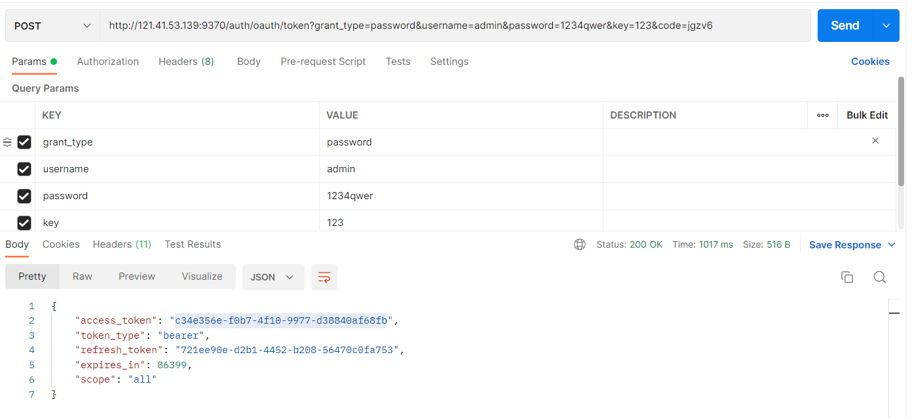
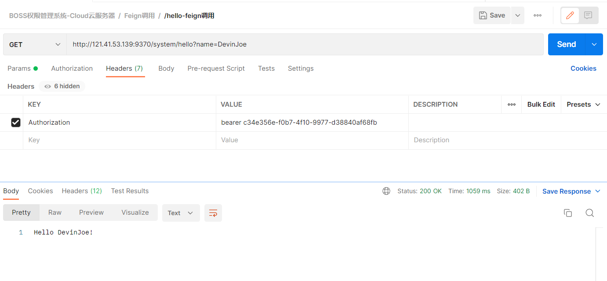
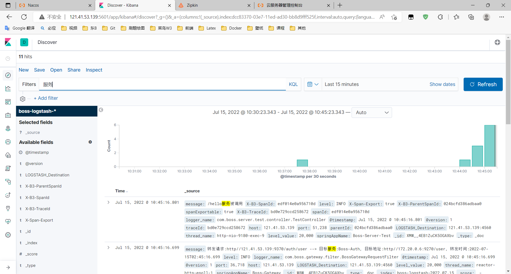
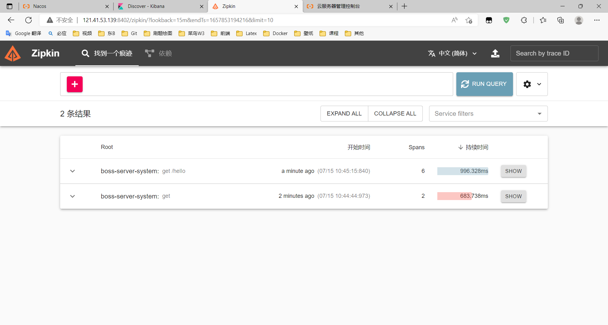
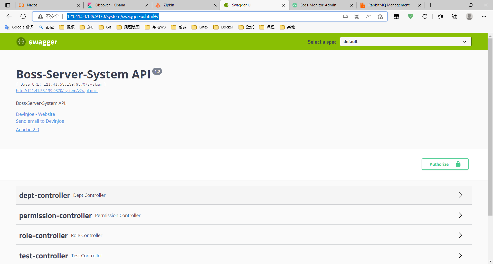
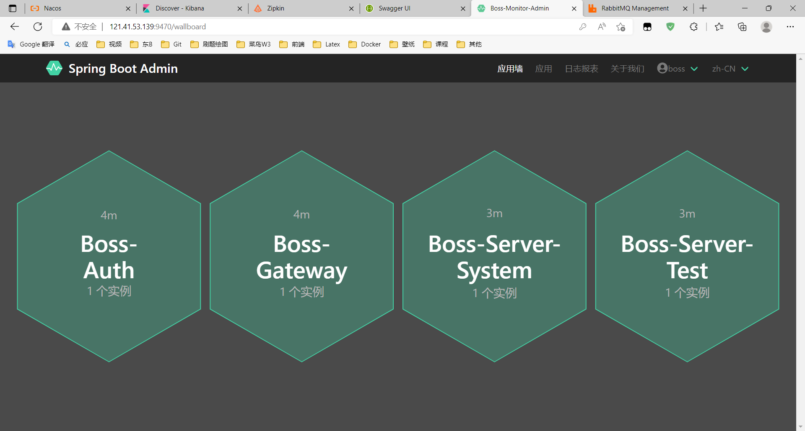
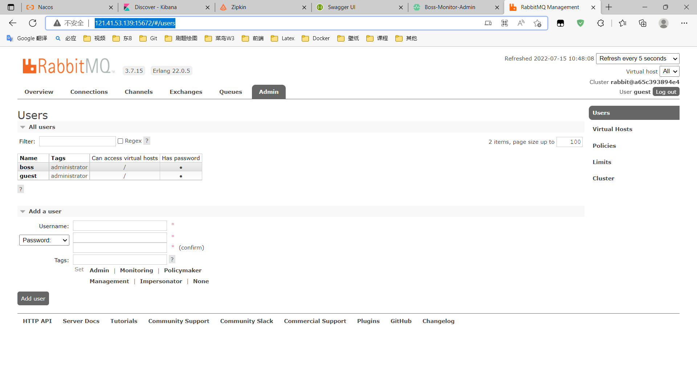

## Boss Cloud微服务系统

### 目录结构

```
Boss-RBAC-Cloud                   ------ 整个项目的父模块
├─boss-auth                       ------ 微服务认证服务器 port:9270
├─boss-common                     ------ 通用模块
├─boss-gateway                    ------ 微服务网关 port:9370
├─boss-monitor                    ------ 微服务监控模块
│  └─boss-monitor-admin           ------ 微服务监控中心 port:9470
├─boss-server                     ------ 微服务子系统
│  ├─boss-server-system           ------ 微服务子系统RBAC模块 port:9170
│  └─boss-server-test             ------ 微服务子系统demo模块 port:9180
├─images                          ------ 微服务系统截图
└─sql                             ------ 微服务所用SQL语句
```

### 项目相关技术地址

> 除了Nacos用户名和密码为nacos，其他用户名为boss，密码为16250

| 技术名称          | 地址                             |
| ----------------- | -------------------------------- |
| Nacos             | http://121.41.53.139:9001/nacos/ |
| Kibana            | http://121.41.53.139:5601/       |
| Zipkin            | http://121.41.53.139:8402/       |
| Swagger           | http://121.41.53.139:9370/       |
| Spring Boot Admin | http://121.41.53.139:9470/       |
| RabbitMQ          | http://121.41.53.139:15672/      |


### Feign调用与容错处理

Feign调用有五处，生产者是boss-server-test模块，消费者是boss-server-system模块。

1. /hello接口

   * 涉及文件
     * com.boss.server.test.controller.TestController
     * com.boss.server.system.controller.TestController
     * com.boss.server.system.feign.IHelloService
     * com.boss.server.system.feign.hystrix.HelloServiceFallback

   * 测试截图

     <table>
       <tr>
         <td align="center" style="background: #fff"><b>/hello接口</b></td>
       </tr>
       <tr>
         <td align="center" style="background: #fff">
           </td>
         </tr>
     </table>

2. /dept/list接口

   * 涉及文件
     * com.boss.server.test.controller.DeptController
     * com.boss.server.system.controller.DeptController
     * com.boss.server.system.feign.IDeptService
     * com.boss.server.system.feign.hystrix.DeptServiceFallback

   * 测试截图

     <table>
       <tr>
         <td align="center" style="background: #fff"><b>/dept/list接口</b></td>
       </tr>
       <tr>
         <td align="center" style="background: #fff">
           </td>
         </tr>
     </table>

3. /dept/add接口

   * 涉及文件

     同2

   * 测试截图

     <table>
       <tr>
         <td align="center" style="background: #fff"><b>/dept/add接口</b></td>
       </tr>
       <tr>
         <td align="center" style="background: #fff">
           </td>
         </tr>
     </table>

4. /dept/update接口

   * 涉及文件

     同2

   * 测试截图

     <table>
       <tr>
         <td align="center" style="background: #fff"><b>/dept/update接口</b></td>
       </tr>
       <tr>
         <td align="center" style="background: #fff">
           </td>
         </tr>
     </table>

5. /dept/delete接口

   * 涉及文件

     同2

   * 测试截图

     <table>
       <tr>
         <td align="center" style="background: #fff"><b>/dept/delete接口</b></td>
       </tr>
       <tr>
         <td align="center" style="background: #fff">
           </td>
         </tr>
     </table>

### 网关接口测试

微服务网关端口为9370

<table>
  <tr>
    <td align="center" style="background: #fff"><b>1./auth/captcha获取验证码</b></td>
  </tr>
  <tr>
    <td align="center" style="background: #fff"></td>
  </tr>
  <tr>
    <td align="center" style="background: #fff"><b>2./auth/oauth/token获取access_token</b></td>
  </tr>
  <tr>
    <td align="center" style="background: #fff"></td>
   </tr>
  <tr>
    <td align="center" style="background: #fff"><b>3./auth/user获取当前登录用户信息</b></td>
  </tr>
  <tr>
    <td align="center" style="background: #fff"></td>
   </tr>
  <tr>
    <td align="center" style="background: #fff"><b>4./system/user/list获取用户列表</b></td>
  </tr>
  <tr>
    <td align="center" style="background: #fff"></td>
   </tr>
  <tr>
    <td align="center" style="background: #fff"><b>5./system/user/add添加用户信息</b></td>
  </tr>
  <tr>
    <td align="center" style="background: #fff"></td>
   </tr>
  <tr>
    <td align="center" style="background: #fff"><b>6./system/role/add添加角色信息</b></td>
  </tr>
  <tr>
    <td align="center" style="background: #fff"></td>
   </tr>
  <tr>
    <td align="center" style="background: #fff"><b>7./system/role/delete删除角色</b></td>
  </tr>
  <tr>
    <td align="center" style="background: #fff"></td>
   </tr>
  <tr>
    <td align="center" style="background: #fff"><b>8./system/role/assign/permission/tree获取角色菜单树</b></td>
  </tr>
  <tr>
    <td align="center" style="background: #fff"></td>
   </tr>
  <tr>
    <td align="center" style="background: #fff"><b>9./system/permission/list分页查询权限信息</b></td>
  </tr>
  <tr>
    <td align="center" style="background: #fff"></td>
   </tr>
  <tr>
    <td align="center" style="background: #fff"><b>10./system/permission/hasChildrenOrRole查询权限是否有子权限或者被分配角色</b></td>
  </tr>
  <tr>
    <td align="center" style="background: #fff"></td>
   </tr>
  <tr>
    <td align="center" style="background: #fff"><b>11.9270/auth/user测试绕过网关获取资源</b></td>
  </tr>
  <tr>
    <td align="center" style="background: #fff"></td>
   </tr>
  <tr>
    <td align="center" style="background: #fff"><b>12./system/user/add添加用户错误用例</b></td>
  </tr>
  <tr>
    <td align="center" style="background: #fff"></td>
   </tr>
</table>
### Nacos使用

<table>
  <tr>
    <td align="center" style="background: #fff"><b>Nacos配置中心</b></td>
  </tr>
  <tr>
    <td align="center" style="background: #fff">
      </td>
   </tr>
  <tr>
    <td align="center" style="background: #fff"><b>Nacos注册中心</b></td>
  </tr>
  <tr>
    <td align="center" style="background: #fff">
      </td>
   </tr>
</table>

### Docker部署

<table>
  <tr>
    <td align="center" style="background: #fff"><b>1.容器截图</b></td>
  </tr>
  <tr>
    <td align="center" style="background: #fff">
      </td>
   </tr>
  <tr>
    <td align="center" style="background: #fff"><b>2.部署后测试/captcha接口</b></td>
  </tr>
  <tr>
    <td align="center" style="background: #fff">
      </td>
   </tr>
  <tr>
    <td align="center" style="background: #fff"><b>3.部署后测试/oauth/token接口</b></td>
  </tr>
  <tr>
    <td align="center" style="background: #fff">
      </td>
   </tr>
  <tr>
    <td align="center" style="background: #fff"><b>4.部署后测试/hello接口</b></td>
  </tr>
  <tr>
    <td align="center" style="background: #fff">
      </td>
   </tr>
</table>

### Kibana

<table>
  <tr>
    <td align="center" style="background: #fff"><b>搜索带有“服务”的日志</b></td>
  </tr>
  <tr>
    <td align="center" style="background: #fff">
      </td>
   </tr>
</table>

### Zipkin

<table>
  <tr>
    <td align="center" style="background: #fff"><b>Zipkin查询</b></td>
  </tr>
  <tr>
    <td align="center" style="background: #fff">
      </td>
   </tr>
</table>

### Swagger

<table>
  <tr>
    <td align="center" style="background: #fff"><b>SwaggerUI</b></td>
  </tr>
  <tr>
    <td align="center" style="background: #fff">
      </td>
   </tr>
</table>

### Spring Boot Admin

<table>
  <tr>
    <td align="center" style="background: #fff"><b>监控中心</b></td>
  </tr>
  <tr>
    <td align="center" style="background: #fff">
      </td>
   </tr>
</table>

### RabbitMQ

<table>
  <tr>
    <td align="center" style="background: #fff"><b>RabbitMQ Admin信息</b></td>
  </tr>
  <tr>
    <td align="center" style="background: #fff">
      </td>
   </tr>
</table>